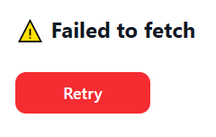

# Crypto Staking Dashboard

🚀 A Next.js + React app that simulates **crypto staking** with real-time fiat–crypto conversion, live charts, and built-in documentation.  
Designed to showcase **frontend engineering skills, architecture clarity, and clean UI/UX** — perfect for recruiters and collaborators.

**URL**: https://crypto-staking-dashboard.vercel.app/

---

## ✨ Features

- 🔄 **Real-time Fiat–Crypto Conversion**  
  Enter amounts in fiat or crypto; the other field updates instantly.  
  Debounced inputs ensure smooth typing without excessive calculations.

- 📈 **Interactive Staking Chart**  
  Visualizes staking growth based on user input (amount, period, currency, crypto).

- 🎨 **Light/Dark Theme Toggle**  
  User preference saved and applied consistently across the app.

- 📚 **Built-in Documentation Page**  
  Explains business logic, architecture, and error handling with code snippets.

- ⚡ **Global Context State Management**  
  Centralized handling for theme, prices, fiat currency, and active page.

---

## 🏗️ Tech Stack

- [Next.js](https://nextjs.org/) – React framework for SSR and routing
- [React](https://react.dev/) – UI library
- [TypeScript](https://www.typescriptlang.org/) – Strong typing and safer code
- [Sass (SCSS)](https://sass-lang.com/) – Custom styling with variables and mixins
- [Recharts](https://recharts.org/) – Chart rendering
- [react-code-blocks](https://www.npmjs.com/package/react-code-blocks) – Syntax highlighting in docs
- [clsx](https://www.npmjs.com/package/clsx) – Conditional class handling
- [CoinGecko API](https://www.coingecko.com/en/api) – Live crypto price data

---

## 🚀 Getting Started

Clone the repo and install dependencies:

```bash
git clone https://github.com/Nillar/crypto-staking-dashboard.git
cd crypto-staking-dashboard
npm install
```
Visit http://localhost:3000
to view the app.
---

## 📂 Project Structure
```php
src/
 ├─ app/                # Next.js app directory
 │   ├─ page.tsx        # Dashboard page
 │   ├─ documentation/  # Documentation page
 │   └─ layout.tsx      # Global layout (header, providers)
 ├─ components/
 │   ├─ global/         # Shared UI (Header, ThemeSwitcher)
 │   ├─ staking/        # StakingForm, StakingChart
 │   └─ documentation/  # Docs helpers (CodeBlock, DocSection, ArchitectureDiagram)
 ├─ context/            # GlobalContext (state, API fetch, theme, fiat, activePage)
 ├─ assets/             # Images and icons
 └─ styles/             # SCSS variables and global styles
```
---

## 🔧 Error Handling

If the CoinGecko API fails, an error message with a Retry button is displayed.

Example:



---

## 📘 Documentation

The Documentation page includes:

**Introduction** – project goals & tech stack

**Business Logic** – fiat–crypto conversion & staking flow

**Architecture Diagram** – visual explanation of component interaction

**Error Handling** – resilience to API failures

---

## 👨‍💻 Made with Next.js, React, and lots of ☕.