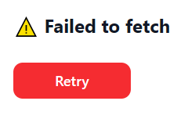

# Crypto Staking Dashboard

🚀 A Next.js + React app that simulates **crypto staking** with real-time fiat–crypto conversion, live charts, and built-in documentation.  
Designed to showcase **frontend engineering skills, architecture clarity, and clean UI/UX** — perfect for recruiters and collaborators.

**Live URL**: https://crypto-staking-dashboard.vercel.app/


---

## ✨ Features

- 🔄 **Real-time Fiat–Crypto Conversion**  
  Enter amounts in fiat or crypto; the other field updates instantly.  
  Debounced inputs ensure smooth typing without excessive calculations.

- 📈 **Interactive Staking Chart**  
  Visualizes staking growth based on user input (amount, period, currency, crypto).

- 🎨 **Light/Dark Theme Toggle**  
  User preference saved and applied consistently across the app.

- 📚 **Built-in Documentation Page**  
  Explains business logic, architecture, and error handling with code snippets.

- ⚡ **Global Context State Management**  
  Centralized handling for theme, prices, fiat currency, and active page.

- ✅ **Full Test Suite**  
  Unit, component, integration, and end-to-end tests, wired into CI via GitHub Actions.

---

## 🏗️ Tech Stack

- [Next.js](https://nextjs.org/) – React framework for SSR and routing
- [React](https://react.dev/) – UI library
- [TypeScript](https://www.typescriptlang.org/) – Strong typing and safer code
- [Sass (SCSS)](https://sass-lang.com/) – Custom styling with variables and mixins
- [Recharts](https://recharts.org/) – Chart rendering
- [react-code-blocks](https://www.npmjs.com/package/react-code-blocks) – Syntax highlighting in docs
- [clsx](https://www.npmjs.com/package/clsx) – Conditional class handling
- [CoinGecko API](https://www.coingecko.com/en/api) – Live crypto price data
- [Vitest](https://vitest.dev/) + [React Testing Library](https://testing-library.com/react) – Unit, component & integration tests
- [Playwright](https://playwright.dev/) – End-to-end browser tests

---

## 🚀 Getting Started

Clone the repo and install dependencies:

```bash
git clone https://github.com/Nillar/crypto-staking-dashboard.git
cd crypto-staking-dashboard
npm install
```
Visit http://localhost:3000
to view the app.
---

## 🧪 Testing

The app is covered by four layers of tests:

| Layer | Tool | What it covers |
|---|---|---|
| Unit | [Vitest](https://vitest.dev/) | Pure logic — staking-growth math (`src/lib/staking.ts`), `useDebounce`, coin data sanity checks |
| Component | Vitest + [React Testing Library](https://testing-library.com/react) | Individual components (`StakingForm`, `StakingChart`, `ThemeSwitcher`, `Header`) rendered against a real `GlobalContext` with a stubbed CoinGecko response |
| Integration | Vitest + RTL | Multiple real units together — the full dashboard page driving `StakingForm` → `StakingChart` through an actual debounce cycle, and `GlobalContext`'s loading/error/theme state machine |
| End-to-end | [Playwright](https://playwright.dev/) | A real Chromium browser against the running app, with the CoinGecko API intercepted via `page.route()` for deterministic runs |

### Running the tests

```bash
npm run test         # unit + component + integration tests (single run)
npm run test:watch   # same, in watch mode
npm run test:e2e     # Playwright e2e suite (headless)
npm run test:e2e:ui  # Playwright, interactive UI mode
```

### Example: unit test

```ts
// src/lib/staking.test.ts
it("compounds the principal over the staking period", () => {
  const series = calculateGrowthSeries({
    amountInFiat: 1000,
    apy: 12,
    periodDays: 90,
  });

  const last = series[series.length - 1];
  expect(last.totalFiat).toBeGreaterThan(1000);
  expect(last.growth).toBeCloseTo(last.totalFiat - last.principal);
});
```

### Example: end-to-end test

```ts
// e2e/dashboard.spec.ts
test("updates the chart after picking a different coin and amount", async ({ page }) => {
  await mockCoinGeckoPrices(page);
  await page.goto("/");

  await page.getByLabel(/Amount in USD/i).fill("20000");
  await page.getByText("BTC — Bitcoin").click();
  await page.getByText("ETH — Ethereum").click();

  await expect(page.getByText("Metrics for Ethereum")).toBeVisible();
});
```

### Continuous Integration

A [GitHub Actions workflow](.github/workflows/ci.yml) runs on every push to `main` and every pull request:

- **`lint-and-unit`** — ESLint + the full Vitest suite
- **`e2e`** — builds the app, installs Chromium, and runs the Playwright suite against the production build; the HTML report is uploaded as a build artifact if any test fails

Node version is pinned via [`.nvmrc`](.nvmrc) to keep local and CI environments in sync.

---

## 📂 Project Structure
```php
src/
 ├─ app/                # Next.js app directory
 │   ├─ page.tsx        # Dashboard page
 │   ├─ page.test.tsx   # Integration tests for the dashboard
 │   ├─ documentation/  # Documentation page
 │   └─ layout.tsx      # Global layout (header, providers)
 ├─ components/
 │   ├─ global/         # Shared UI (Header, ThemeSwitcher) + their tests
 │   ├─ staking/        # StakingForm, StakingChart + their tests
 │   └─ documentation/  # Docs helpers (CodeBlock, DocSection, ArchitectureDiagram)
 ├─ context/            # GlobalContext (state, API fetch, theme, fiat, activePage) + its tests
 ├─ lib/                # Extracted pure logic (staking math, coin data) + unit tests
 ├─ hooks/              # Custom hooks (useDebounce) + unit tests
 ├─ test/               # Shared test helpers (testUtils.tsx)
 ├─ assets/             # Images and icons
 └─ styles/             # SCSS variables and global styles

e2e/                    # Playwright end-to-end specs + helpers
.github/workflows/      # CI pipeline (lint, unit, e2e)
```
---

## 🔧 Error Handling

If the CoinGecko API fails, an error message with a Retry button is displayed.

Example:



---

## 📘 Documentation

The Documentation page includes:

**Introduction** – project goals & tech stack

**Business Logic** – fiat–crypto conversion & staking flow

**Architecture Diagram** – visual explanation of component interaction

**Error Handling** – resilience to API failures

**Testing** – unit, component, integration & e2e layers, with real code snippets and CI details

---

## 👨‍💻 Made with Next.js, React, and lots of ☕.
